# Quad Copter Elevation and Bank Attitude Closed Loop Linearized Response

## Abstract:
This analysis looks at deriving feedback control gains about the linearized lateral and longitudinal dynamics of a Parrot Rolling Spider quad copter. The derived gains are then inputted into the quad copter and the state variables are measured utilizing sensors on the quad copter as the copter's steady state response is deviated using a force-full perturbation. A comparison is then made between this real-life data to a MATLAB simulation of the quad copter that transforms the copter's dynamics into first order differential equations that are solved over discrete time steps utilizing an adaptive 4th and 5th order Runge Kutta ODE solver.

## Feedback Control System for Linearized Model:

  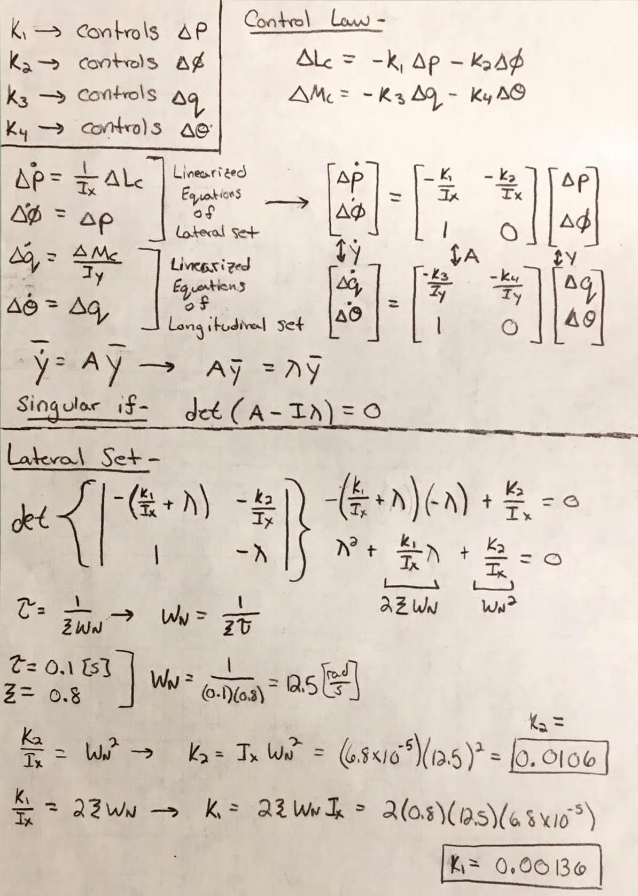
   
  Derivation - Quad Copter Stability about Elevation and Bank Attitude
  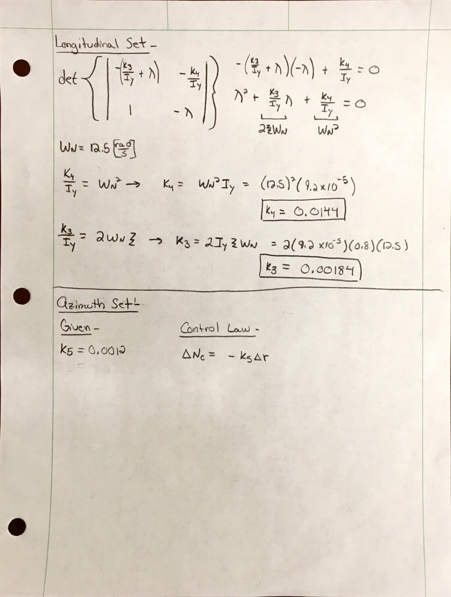
   
  Derivation - Quad Copter Stability about Elevation and Bank Attitude

The derivations for the feedback control system about the lateral and longitudinal dynamics were done by the coupled sets. The "lateral set", was comprised of the variables of roll rate and the Euler angle $\phi$ which are dependent on each other and their corresponding gains were found using the control law and solving for the gains that satisfied having a time constant of $\tau = 0.1 [s]$ with a damping ration of $\zeta = 0.8$. The same was done for "longitudinal set", which was comprised of the coupled variables of pitch rate and the Euler angle $\theta$.

## Simulated - Closed Loop Linearized Response
 

    Deviation of $+5^{\circ}$ in Bank
     
    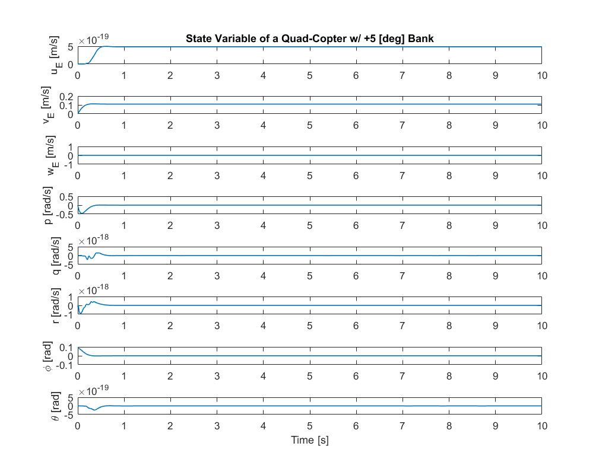
      
    Deviation of $+5^{\circ}$ in Pitch
     
    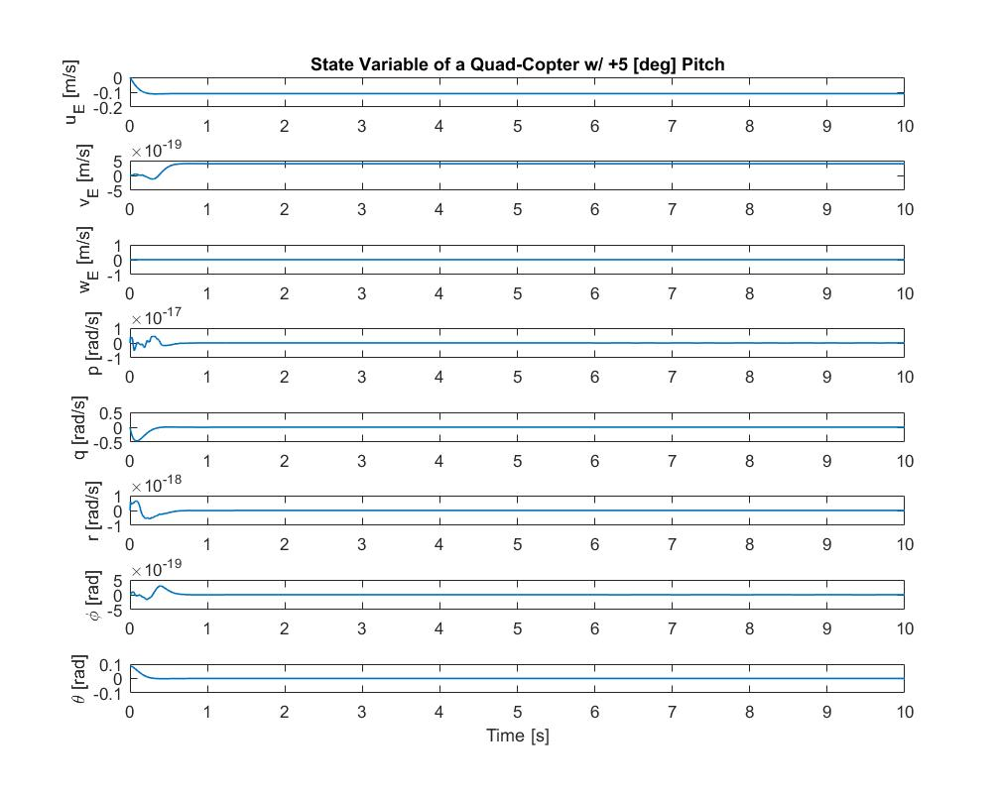
     
    Deviation of +0.1 $\frac{rad}{s}$ in Roll Rate
     
    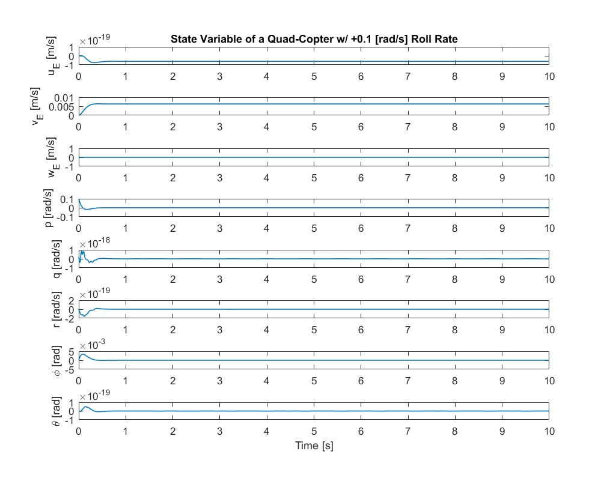
      
    Deviation of $+0.1 [\frac{rad}{s}]$ in Pitch Rate
     
    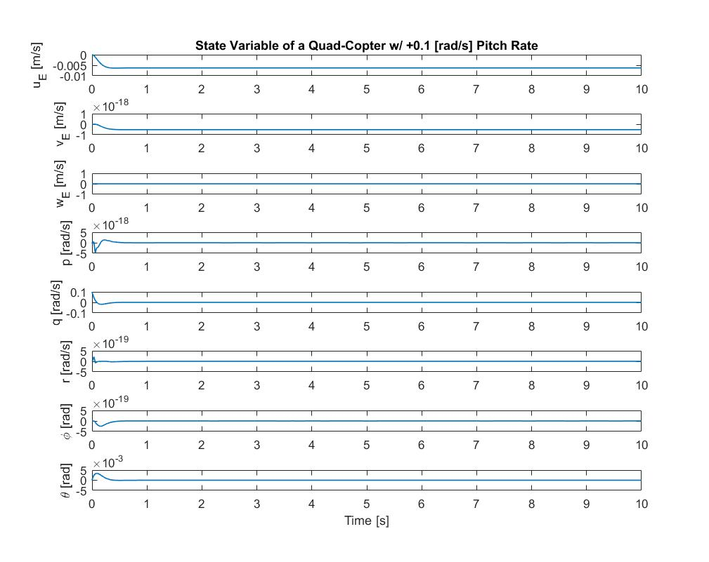

 

The linearized response of the quad copter reacts in the way we expect for the different deviations in the attitude and rotation. The coupled sets in the linearized model remained coupled after the feedback controls were implemented. This is shown in the figures for the linearized model as the variations in the bank angle resulted in changes in the roll rate and in the y-component of the body fixed coordinate representation of inertial velocity. When the roll rate was varied, changes in bank angle and y-component of the body fixed coordinate representation of inertial velocity were seen. This is due to these three variables ($V_E$, $\phi$, and p) being coupled as the "lateral set" in the linearized model for a steady hover state. The other coupled set, the "longitudinal set", also remain coupled. This can be depicted in the plots for the variations in either $\theta$ or $q$, resulting in changes in the resulting coupled variables of $\theta$, q, and $U_E$. The resulting system is also noticed to now be neutrally stable. Deviations in the attitude and rotational nature of the body frame, result in a feedback response until the perturbations are resolved back to a steady hovering state. The reason they are only neutrally stable and not completely stable is due to the fact that the quad copter continues to translate after the attitude and rotation are resolved back to their trim states for steady hovering flight. 

## Simulated - Linearized and Non-Linearized Response Comparison:

    Deviation of  in Bank
      
    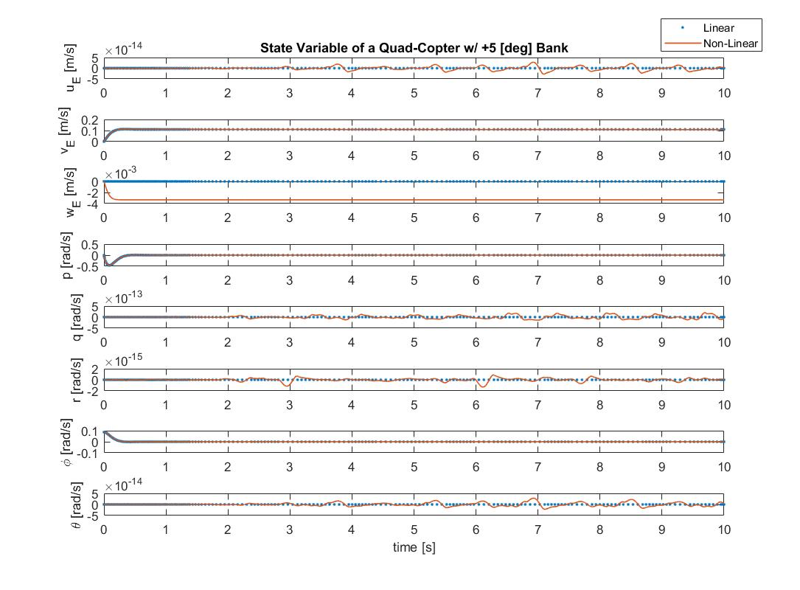
      
    Deviation of $+0.1 [\frac{rad}{s}]$ in Pitch
     
    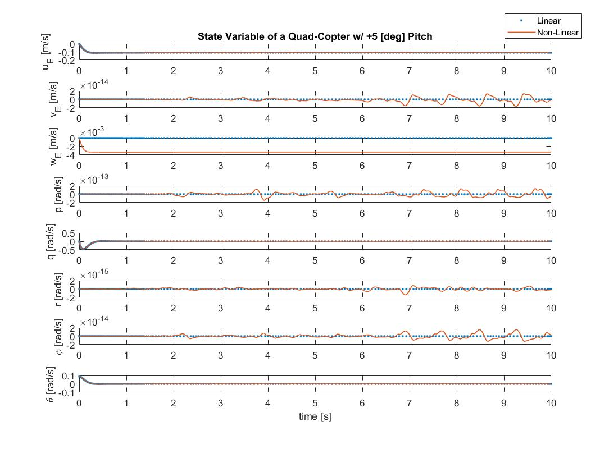
      
    Deviation of $+0.1 [\frac{rad}{s}]$ in Roll Rate
     
    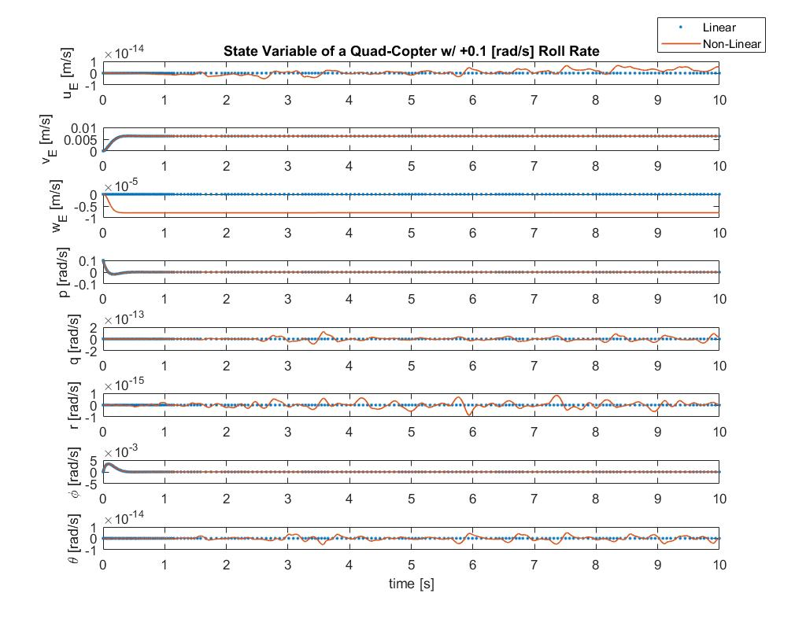
      
    Deviation of $+0.1 [\frac{rad}{s}]$ in Pitch Rate
     
    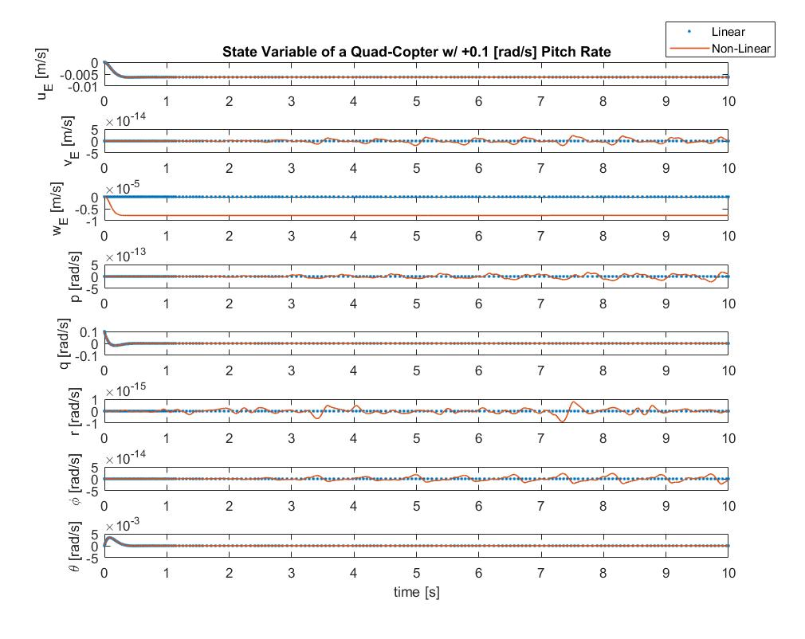

 

When implementing the linearized feedback control design to the non-linear model, there were very slight differences in response. While all the state variables remained with in the linearized model's result, there were slight variations in the nosiness of the state variables. Granted the largest variation between the linearized and non-linearized response  for any of the state variables was on the order of magnitude of $10^{-3}$, there were still small variations. These small variations most likely occur due to the coupled nature of the variables as they change, causing small changes in each other on a scale that the precision of ODE45 cannot account for. It should also be noted that even though the linearized model does not directly account for aerodynamic effects, the results show to be nearly unaffected. 

## Rolling Spider Experimental Data w/ Implemented Gains:
  

    Translation of Rolling Spider
      
    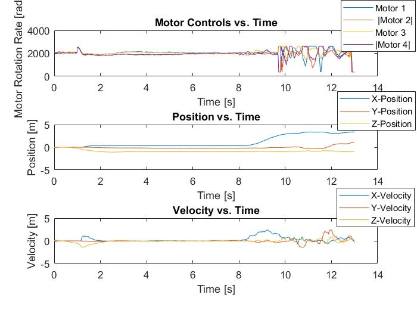
     
    Attitude of Rolling Spider
     
    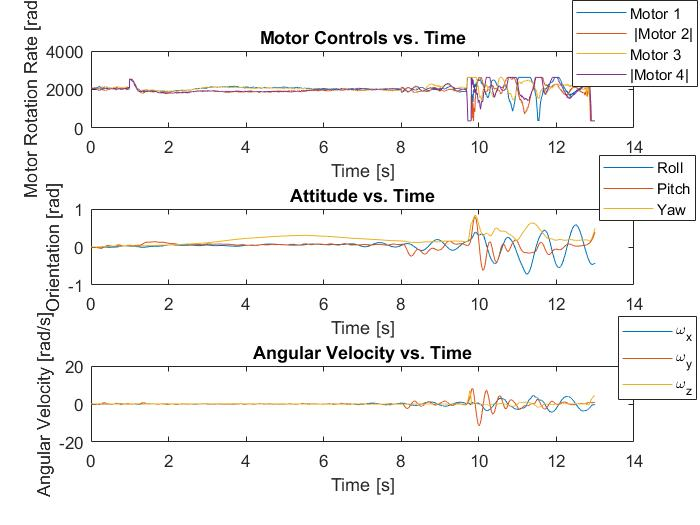

 

When comparing the data between the experimental model and the simulations from MATLAB, it is evident that the response of the real life quad copter to deviations in bank and elevation are to emulate. When the quad copter was given a change in the elevation angle, and the gains we derived are applied, the copter corrects back and forth until it eventually hits the net. If the net were larger, the copter would eventually go back to a fixed attitude, with some translation. This was partially modeled by the experimental data as it is noticed the copter corrects itself as it translates. Before hitting the net, the copter is noticed to have angular velocities that slowly emanate back to zero. This shows that while the experimental case varies from the simulations, the overall trends remain apparent. 
